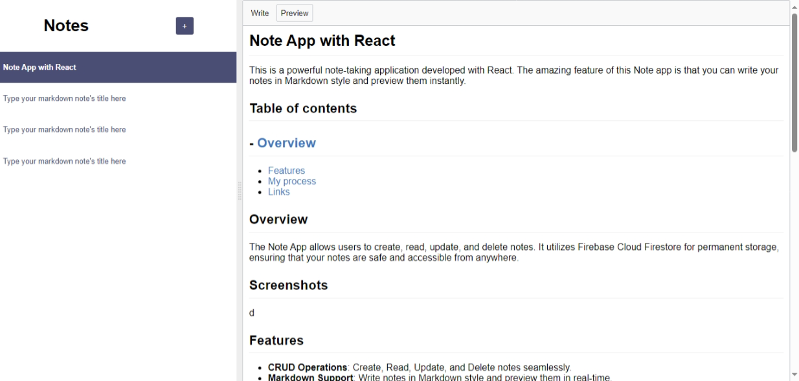

# Note App with React

This is a powerful note-taking application developed with React. The amazing feature of this Note app is that you can write your notes in Markdown style and preview them instantly.

## Table of contents

- [Overview](#overview)
- [Screenshots](#screenshots)
- [Features](#features)
- [My proces](#my-process)

## Overview

The Note App allows users to create, read, update, and delete notes. It utilizes Firebase Cloud Firestore for permanent storage, ensuring that your notes are safe and accessible from anywhere.

## Screenshots

   

   

## Features

- **CRUD Operations**: Create, Read, Update, and Delete notes seamlessly.
- **Markdown Support**: Write notes in Markdown style and preview them in real-time.
- **Firebase Integration**: Notes are stored in Firebase Cloud Firestore, providing reliable and permanent storage.
- **Recent Notes**: Newly created notes automatically move to the top of the list for easy access.

## My process

### Technology

* HTML
* CSS
* React

### Dependencies

1. **Firebase**

   - Firebase is a powerful platform that provides backend services for web and mobile applications. In this Note App, it is used for storing notes in Cloud Firestore, enabling seamless data management with real-time updates and secure storage.
2. **React MDE**

   - React MDE is a Markdown editor for React applications. It allows users to write notes using Markdown syntax, providing a rich text editing experience.
3. **React Split**

   - React Split is a library for creating resizable split views in React applications. In this Note App, it is used to create a dynamic layout where users can adjust the size of the editor and preview panes, enhancing the overall usability of the note-taking interface.
4. **Showdown**

   - Showdown is a JavaScript library that converts Markdown into HTML. This dependency is crucial for rendering the Markdown notes written by users into formatted HTML for preview. It ensures that notes are displayed correctly, maintaining the intended formatting and style.

### What I learned

- **Working with Firebase**: I learned how to integrate Firebase with React, including setting up authentication and Firestore for data storage.
- **CRUD Operations**: I gained experience in implementing CRUD functionalities and how to manage state effectively in React.
- **Markdown Syntax**: I learned how to parse and render Markdown content, enhancing the note-taking experience.
- **Real-time Data Handling**: Understanding how to work with real-time data in Firebase was a key takeaway from this project.

This project has improved my skills significantly and provided me with practical experience in developing a full-stack application with React and Firebase. I look forward to expanding its features in the future!
